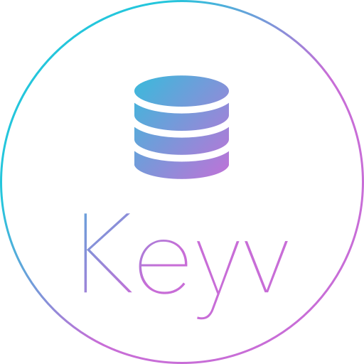

{{ ossHeader }}

<h1 id="keyv-null-img-align-right-src-logo-svg-alt-keyv-logo-title-keyv-logo-width-100-">Keyv - Momento </h1>
<p>This project is part of the <a href="https://www.npmjs.com/package/keyv">Keyv</a> suite.</p>

## What and why?

This project is a [Momento](https://gomomento.com) storage adaptor for [Keyv](https://github.com/jaredwray/keyv)

TTL functionality is handled directly by momento so no timestamps are stored and expired keys are cleaned up internally.

## Installation

```shell
npm install --save @gomomento-poc/node-keyv-adaptor
```

## Usage

```ts
import KeyvMomento from "@gomomento-poc/node-keyv-adaptor";

const Keyv = require('keyv');

const keyv = new Keyv({
  store: new KeyvMomento(
    new CacheClient({
      configuration: Configurations.Laptop.latest(),
      credentialProvider: CredentialProvider.fromEnvironmentVariable({
        environmentVariableName: "MOMENTO_AUTH_TOKEN"
      }),
      defaultTtlSeconds: 6000
    }),
    "default-cache",
  )
})
```

{{ ossFooter }}
